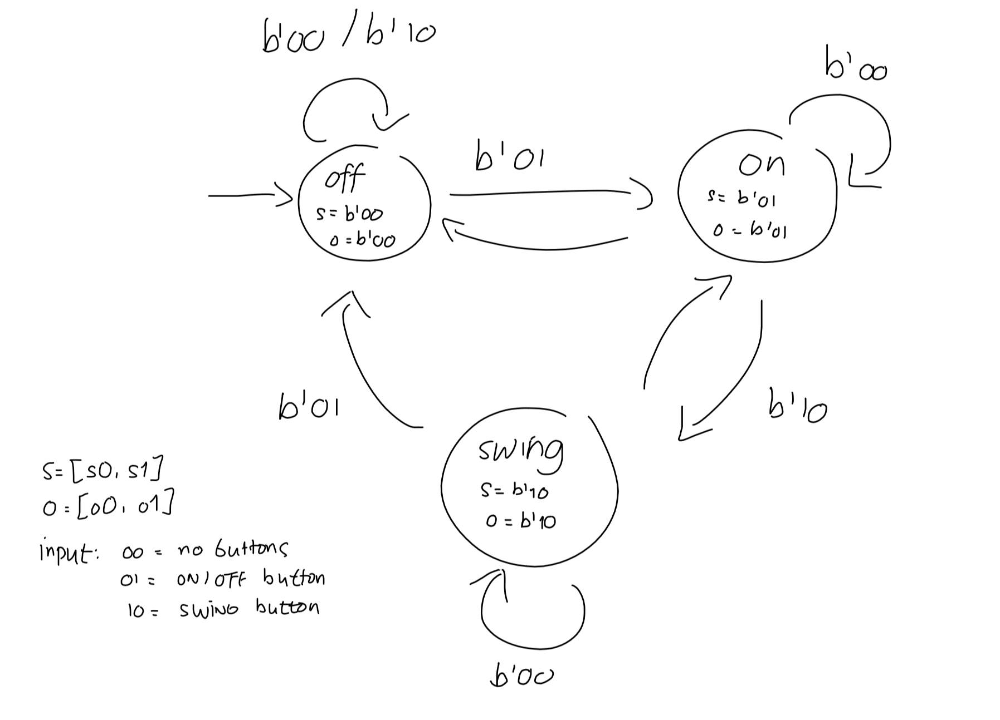
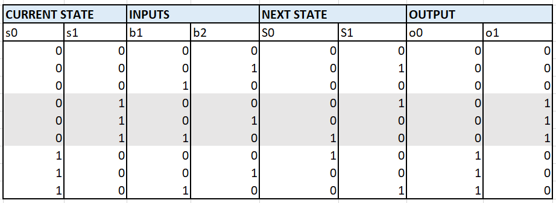

# Air Conditioner with a Finite State Machine

Name: Edelyne Keisha

Class: L1BC

NIM: 2602169850

## Introduction

The system used here is an Air Conditioner, and it has 3 states: OFF, ON, and SWING. There are two buttons used as input: SWING and ON/OFF.

## Finite State Diagram

The Air Conditioner has a remote, and the remote has 2 buttons: SWING and ON/OFF.

ON/OFF = to change the Air Conditioner from OFF state to ON state, and vice versa.

SWING = to change from SWING state to ON state and vice versa, but it can't be used from OFF state.

## State and Transition Diagram

From this table, we can find the boolean equation.

## Karnaugh Map

