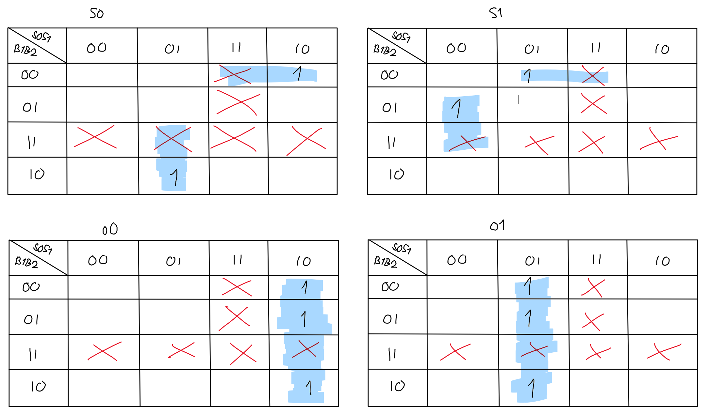
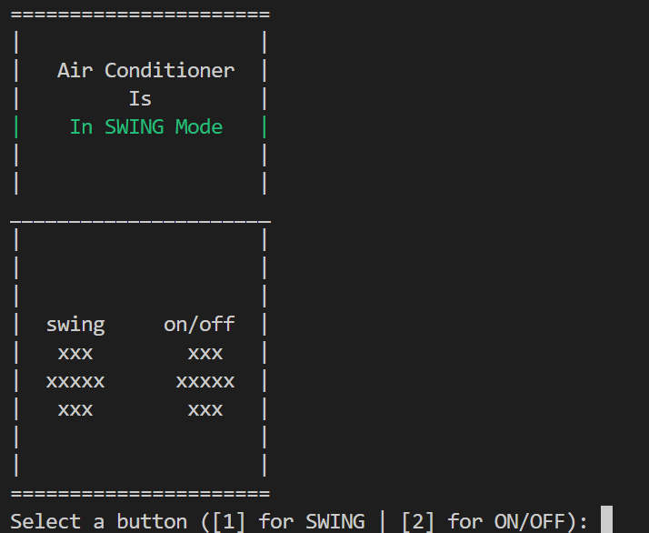

# Air Conditioner with a Finite State Machine

Name: Edelyne Keisha

Class: L1BC

NIM: 2602169850

## Introduction

The system used here is an Air Conditioner, and it has 3 states: OFF, ON, and SWING. There are two buttons used as input: SWING and ON/OFF.


## Finite State Diagram


The Air Conditioner has a remote, and the remote has 2 buttons: SWING and ON/OFF.

ON/OFF = to change the Air Conditioner from OFF state to ON state, and vice versa.

SWING = to change from SWING state to ON state and vice versa, but it can't be used from OFF state.

Firstly, the diagram will start from 00, which is an off state. Pressing 1(SWING) will keep it in off state, and to turn it on, we need to press 2(ON/OFF). After it moves to the second state, 01, we can either press 2 to turn it off again, or press 1 to move it to SWING mode, which is the third state. In this third state, 10, press 2 to turn the AC off, or press 1 to move it back to on state.


## State and Transition Diagram

From the Diagram, we can make this table:


From this table, we can find the boolean equation.


## Karnaugh Map



From that Karnaugh Map, we can conclude that the equation will be:


## How To Run

In Visual Studio Code's Terminal, type in:
```c
make
```


## Output

### OFF State

The AC Remote Control will look like this when it started:


### ON State

Pressing 2, which is ON, will turn it to this:


### SWING State

And pressing 1, which is SWING, will turn it to this:



